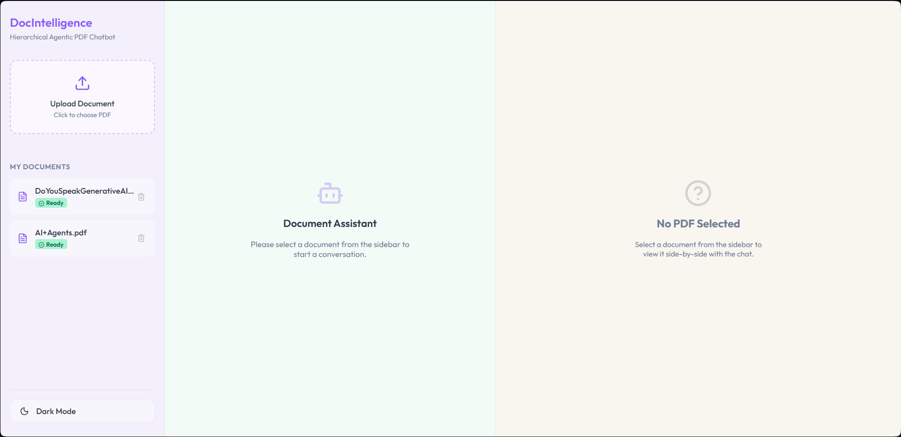
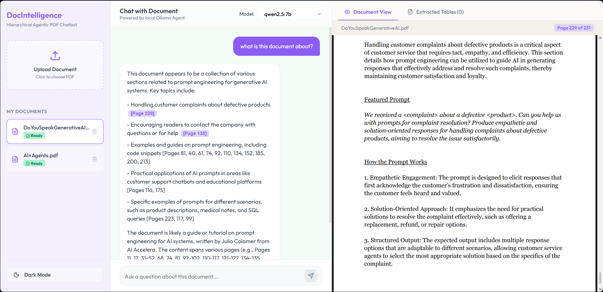

# DocIntelligence — Hierarchical Agentic PDF Chatbot

DocIntelligence is an enterprise-grade document intelligence system designed to instantly parse, index, and query very large PDFs (up to 1,000 pages) using local AI. 

The system leverages a **Hybrid RAG (Retrieval-Augmented Generation) Architecture** combining SQLite FTS5 sparse indexing, Qdrant dense vector search, Cross-Encoder reranking, and LangGraph-driven agentic routing.

---

## 📸 Screenshots

### 1. Document Workspace & PDF Viewer


### 2. Conversational Agent & Citations


---

## ⚡ Key Features

1. **Adaptive Ingestion Router**
   - **Fast Ingestion Mode** (PyMuPDF): Pages < 100 parse in less than 10 seconds.
   - **Advanced Ingestion Mode** (Docling): Pages >= 100 run full semantic chunking and layout parsing.
   - **Automatic Fallback**: Automatically falls back to Fast Mode if Advanced Mode runs into memory or system exceptions.
2. **Dynamic Query Routing (LangGraph)**
   - Classified queries are dynamically routed. 
   - **Simple Factual/Metadata/Table Queries** bypass the expensive agent loops and LLM reflection checks, returning accurate answers in **under 3 seconds**.
   - **Complex Synthesis Queries** run the full multi-query expansion and LLM reflection checks.
3. **Hybrid Search & Exact-Match Shortcuts**
   - Combines FTS5 sparse matching and Qdrant dense vector retrieval using **Reciprocal Rank Fusion (RRF)**.
   - Queries targeting specific pages (e.g. *"page 5"*) or exact clauses route directly to FTS5, bypassing dense embedding computations.
4. **Thread-Safe In-Memory Caching**
   - Caches FTS5 database lookups, Cross-Encoder reranking scores, and reflection outcomes. Repeated or highly similar queries achieve sub-millisecond response latency.
5. **Accurate Page Citations**
   - Responses cite exact page references from the source document (e.g. `[Page 4]`), quoting precise sections to ensure zero-hallucination grounding.

---

## 🛠️ Technology Stack

- **Frontend**: React, Vite, Vanilla CSS, Lucide Icons, PDF.js
- **Backend**: FastAPI, Uvicorn, Python asyncio
- **Databases**: SQLite (FTS5 search enabled), Qdrant (Local In-Memory Vector Store)
- **Agent Orchestration**: LangGraph, LangChain
- **Local LLM & Embedding Service**: Ollama (Qwen2.5 & nomic-embed-text)

---

## ⚙️ Prerequisites

Before starting, make sure you have the following installed on your machine:

1. **Python 3.10+**
2. **Node.js 18+** & **npm**
3. **Ollama** (Running locally)
   - Pull the required models:
     ```bash
     ollama pull qwen2.5:7b
     ollama pull nomic-embed-text:latest
     ```

---

## 🚀 Installation & Setup

1. **Clone the repository**:
   ```bash
   git clone https://github.com/SK4LEGENDS/DocIntelligence.git
   cd DocIntelligence
   ```

2. **Set up the Backend**:
   ```bash
   pip install -r backend/requirements.txt
   ```

3. **Set up the Frontend**:
   ```bash
   cd frontend
   # Install dependencies
   npm install
   cd ..
   ```

---

## 🏃 Running the Application

To start both the Backend (FastAPI) and Frontend (Vite Dev Server) with a single command, run the orchestrator from the project root:

```bash
node start.js
```

- **Frontend Dashboard**: Open [http://localhost:5173](http://localhost:5173) in your browser.
- **Backend API**: Running on [http://localhost:8000](http://localhost:8000).
- **API Swagger Docs**: Interactive documentation at [http://localhost:8000/docs](http://localhost:8000/docs).

---

## 🧪 Verification & Testing

To test and verify that your local environment is correctly configured, run the optimization verification script:

```bash
python verify_optimization.py
```
This script checks:
- PyMuPDF fast parsing.
- Ollama embedding generation and cache hit speed.
- LLM query routing and complexity classification.